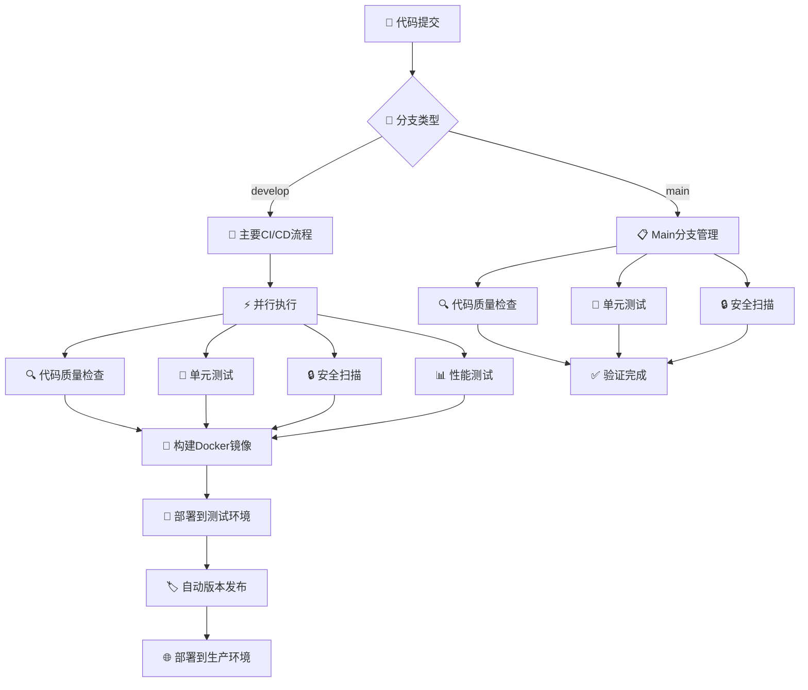
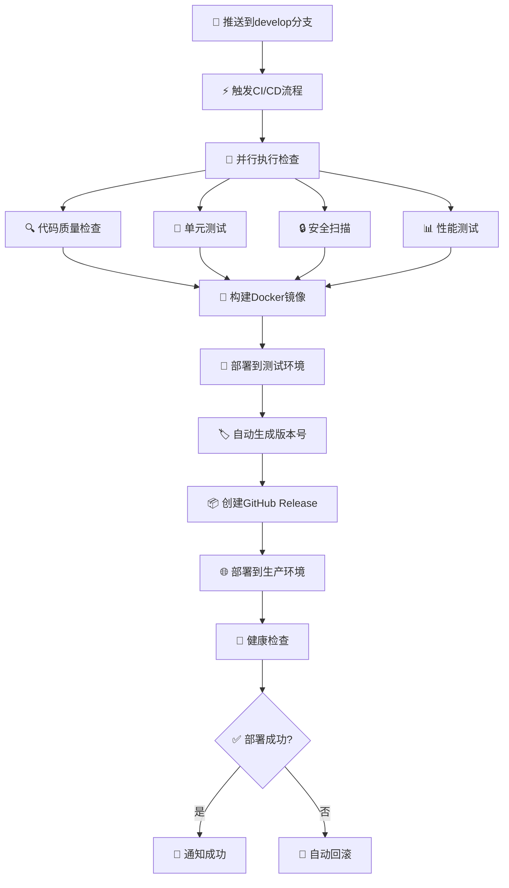
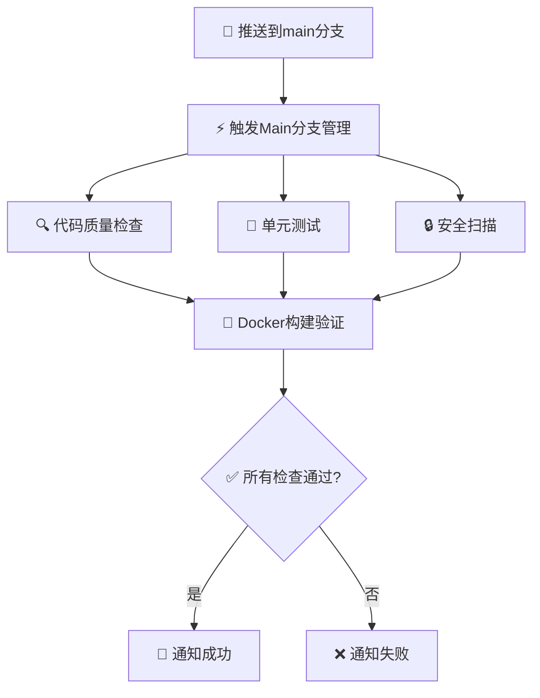
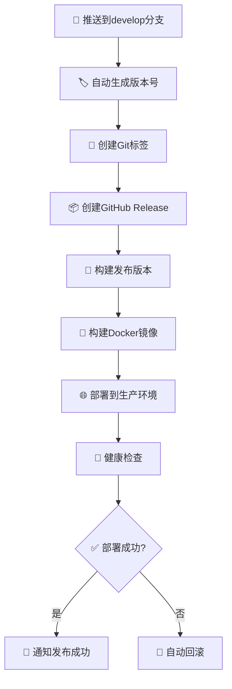

# 🚀 CI/CD 流程文档

## 📋 概述

本项目采用现代化的CI/CD流程，基于GitHub Actions实现自动化构建、测试、部署和监控。经过全面优化，提供：

- ⚡ **快速构建**：并行执行，智能缓存
- 🔒 **安全可靠**：多层安全检查，自动回滚
- 📊 **全面监控**：实时状态，详细报告
- 🎯 **智能发布**：自动版本管理，零停机部署

## 🏗️ 架构设计

### 🌿 分支策略
| 分支 | 用途 | 触发工作流 | 部署环境 | 版本策略 |
|------|------|------------|----------|----------|
| `develop` | 主要开发分支 | `ci.yml` | 测试环境 → 生产环境 | 自动递增PATCH版本 |
| `main` | 代码管理分支 | `main-branch.yml` | 仅验证，不部署 | 无版本发布 |
| `v*/develop` | 大版本开发分支 | `release.yml` | 生产环境 | 基于大版本递增小版本 |

### 📁 工作流文件
| 文件 | 功能 | 触发条件 | 主要作业 |
|------|------|----------|----------|
| `ci.yml` | 主要CI/CD流程 | develop分支推送 | 质量检查、测试、构建、部署 |
| `main-branch.yml` | Main分支管理 | main分支推送 | 质量检查、测试、验证 |
| `release.yml` | 版本发布 | develop推送、手动触发 | 版本生成、发布、部署 |
| `dependabot.yml` | 依赖更新 | Dependabot PR | 安全检查、自动合并 |

## 🔄 流程图表

### 🎯 完整CI/CD流程


### 🚀 Develop分支流程


### 📋 Main分支流程


### 🏷️ 版本发布流程


## 🔧 工作流详情

### 1. 🚀 主要CI/CD流程 (`.github/workflows/ci.yml`)

**触发条件：**
- 📝 推送到 `develop` 分支
- 🔄 创建Pull Request到 `develop` 分支
- 🎯 手动触发（workflow_dispatch）

**包含的作业：**

#### 🔍 代码质量检查 (code-quality)
- **SpotBugs**：静态代码分析，检测潜在bug
- **Checkstyle**：代码风格检查，确保代码规范
- **PMD**：代码质量分析，优化代码结构
- **报告生成**：详细的代码质量报告

#### 🧪 单元测试 (unit-tests)
- **服务启动**：MySQL和Redis测试服务
- **测试执行**：运行所有单元测试
- **覆盖率报告**：生成测试覆盖率报告
- **结果上传**：测试结果和报告上传

#### 🔗 集成测试 (integration-tests)
- **测试套件**：运行完整的集成测试
- **组件验证**：验证系统组件间的交互
- **环境测试**：在真实环境中测试

#### 📊 性能测试 (performance-tests)
- **负载测试**：模拟真实用户负载
- **压力测试**：测试系统极限性能
- **性能报告**：详细的性能分析报告

#### 🔒 安全扫描 (security-scan)
- **依赖扫描**：OWASP Dependency Check扫描漏洞
- **安全报告**：详细的安全分析报告
- **漏洞修复**：提供修复建议

#### 🐳 Docker镜像构建 (build-docker)
- **多架构支持**：linux/amd64, linux/arm64
- **容器注册**：推送到GitHub Container Registry
- **构建优化**：Docker Buildx和缓存优化

#### 🚀 部署 (deploy-staging)
- **自动部署**：部署到测试环境
- **健康检查**：自动执行健康检查
- **状态通知**：实时状态通知

### 2. 📋 Main分支管理工作流 (`.github/workflows/main-branch.yml`)

**触发条件：**
- 📝 推送到 `main` 分支
- 🔄 创建Pull Request到 `main` 分支

**功能：**
- 🔍 **代码质量检查**：SpotBugs、Checkstyle、PMD
- 🧪 **单元测试**：完整测试套件执行
- 🔒 **安全扫描**：OWASP依赖漏洞扫描
- 🐳 **Docker构建验证**：验证镜像构建（不部署）
- 📢 **状态通知**：实时状态通知

### 3. 🏷️ 发布工作流 (`.github/workflows/release.yml`)

**触发条件：**
- 📝 推送到 `develop` 分支（自动生成版本号）
- 🌿 推送分支版本 (v*/develop)
- 🎯 手动触发发布

**功能：**
- 🏷️ **自动版本生成**：基于最新标签递增版本
- 📦 **创建GitHub Release**：自动创建发布页面
- 🔨 **构建发布版本**：生产环境构建
- 🐳 **Docker镜像构建**：多架构镜像构建
- 🌐 **自动部署到生产环境**：零停机部署
- 🔄 **回滚检查**：部署失败自动回滚

### 4. 🔄 依赖更新 (`.github/workflows/dependabot.yml`)

**功能：**
- 🤖 **自动合并**：Dependabot的依赖更新PR
- 🔒 **安全检查机制**：仅合并安全更新
- ⚡ **智能过滤**：避免冲突的依赖更新
- 📢 **通知机制**：更新状态通知

## 🚀 部署策略

### 🧪 测试环境部署
| 项目 | 详情 |
|------|------|
| **触发** | 推送到develop分支 |
| **环境** | staging |
| **镜像标签** | develop |
| **健康检查** | 自动执行 |
| **部署方式** | 蓝绿部署 |

### 🌐 生产环境部署
| 项目 | 详情 |
|------|------|
| **触发** | 从develop分支发布版本 |
| **环境** | production |
| **镜像标签** | 版本号 |
| **健康检查** | 自动执行 |
| **回滚机制** | 部署失败时自动回滚 |
| **部署方式** | 滚动更新 |

## 🏷️ 版本管理

### 📊 版本号生成
| 分支类型 | 版本格式 | 生成方式 | 示例 |
|----------|----------|----------|------|
| **develop分支** | v1.0.0, v1.0.1, v1.0.2 | 基于最新标签自动递增PATCH版本 | v1.0.0 → v1.0.1 |
| **v*/develop分支** | v1.0.0, v1.0.1, v1.0.2 | 基于大版本自动递增PATCH版本 | v1.0.0 → v1.0.1 |
| **手动触发** | 自定义版本 | 手动指定版本号 | v2.0.0-beta |

### 🔄 版本发布流程

#### 🚀 develop分支发布
1. 📝 **推送到develop分支**
2. 🏷️ **自动生成版本号**（基于最新标签递增）
3. 📌 **创建Git标签**
4. 📦 **创建GitHub Release**
5. 🐳 **构建Docker镜像**
6. 🌐 **部署到生产环境**

#### 🏷️ 大版本分支发布
1. 📝 **推送到v1.0.0/develop分支**
2. 🏷️ **自动生成版本号**（基于大版本递增PATCH版本）
3. 📌 **创建Git标签**
4. 📦 **创建GitHub Release**
5. 🐳 **构建Docker镜像**
6. 🌐 **部署到生产环境**

## 📊 监控和告警

### 💚 健康检查
| 检查项目 | 端点 | 检查内容 |
|----------|------|----------|
| **应用健康** | `/actuator/health` | 应用状态、内存、CPU |
| **数据库连接** | 自动检查 | 连接状态、响应时间 |
| **Redis连接** | 自动检查 | 连接状态、缓存性能 |
| **服务可用性** | 自动检查 | 服务响应、负载均衡 |

### 🚨 告警机制
| 告警类型 | 触发条件 | 通知方式 |
|----------|----------|----------|
| **构建失败** | CI/CD流程失败 | 邮件、Slack |
| **部署失败** | 部署流程失败 | 邮件、Slack |
| **健康检查失败** | 服务不可用 | 邮件、Slack |
| **自动回滚** | 部署失败回滚 | 邮件、Slack |

## 📖 使用指南

### 🚀 日常开发流程
```bash
# 1. 在develop分支开发
git checkout develop
git add .
git commit -m "feat: add new feature"
git push origin develop

# 2. 自动触发CI/CD
# ✅ 代码质量检查
# ✅ 单元测试
# ✅ 安全扫描
# ✅ 性能测试
# ✅ 部署到测试环境
# ✅ 自动生成版本号并发布
```

### 🏷️ 大版本开发流程
```bash
# 1. 创建大版本分支
git checkout -b v1.0.0/develop
git push origin v1.0.0/develop

# 2. 在大版本分支开发
git add .
git commit -m "feat: add v1.0.0 feature"
git push origin v1.0.0/develop

# 3. 自动触发版本发布
# ✅ 基于大版本自动递增PATCH版本
# ✅ 创建Git标签（如：v1.0.0, v1.0.1, v1.0.2）
# ✅ 创建GitHub Release
# ✅ 构建Docker镜像
# ✅ 部署到生产环境
```

### 📋 代码管理流程
```bash
# 1. 合并到main分支
git checkout main
git merge develop
git push origin main

# 2. 自动触发代码管理
# ✅ 代码质量检查
# ✅ 单元测试
# ✅ 安全扫描
# ✅ Docker构建验证
```

### 🎯 手动部署
```bash
# 使用Docker Compose
docker-compose -f docker-compose.production.yml up -d

# 使用Kubernetes
kubectl apply -f k8s/production/
```

## 🔧 故障排除

### ❌ 构建失败
| 问题类型 | 解决方案 |
|----------|----------|
| **代码质量** | 检查SpotBugs、Checkstyle、PMD报告 |
| **测试失败** | 修复单元测试，检查测试覆盖率 |
| **依赖问题** | 更新依赖版本，检查兼容性 |

### 🚀 部署失败
| 问题类型 | 解决方案 |
|----------|----------|
| **环境变量** | 检查配置，验证环境变量 |
| **镜像构建** | 验证Docker镜像，检查构建日志 |
| **资源限制** | 调整内存、CPU限制 |

### 📊 性能问题
| 问题类型 | 解决方案 |
|----------|----------|
| **JVM参数** | 调整堆内存、GC参数 |
| **资源配置** | 优化CPU、内存分配 |
| **应用监控** | 监控性能指标，分析瓶颈 |

## 🎯 最佳实践

### 📝 代码提交
| 实践 | 说明 |
|------|------|
| **小批量提交** | 每次提交只包含一个功能 |
| **清晰信息** | 使用conventional commits格式 |
| **代码审查** | 所有代码必须经过审查 |
| **测试覆盖** | 新功能必须包含测试 |

### 🧪 测试策略
| 测试类型 | 覆盖率目标 | 说明 |
|----------|------------|------|
| **单元测试** | 80%+ | 核心业务逻辑测试 |
| **集成测试** | 60%+ | 组件交互测试 |
| **性能测试** | 100% | 负载、压力、峰值测试 |
| **自动化报告** | 100% | 测试结果自动生成 |

### 🚀 部署策略
| 策略 | 说明 |
|------|------|
| **蓝绿部署** | 零停机部署，快速回滚 |
| **滚动更新** | 渐进式更新，降低风险 |
| **自动回滚** | 部署失败自动回滚 |
| **健康检查** | 部署后自动健康检查 |

### 📊 监控和告警
| 监控项目 | 告警阈值 | 说明 |
|----------|----------|------|
| **应用健康** | 响应时间 > 2s | 应用性能监控 |
| **错误率** | 错误率 > 1% | 错误率监控 |
| **资源使用** | CPU > 80% | 资源使用监控 |
| **自动告警** | 实时通知 | 多渠道告警通知 |

### ⚡ 缓存优化
| 缓存类型 | 优化策略 | 说明 |
|----------|----------|------|
| **Maven依赖** | 智能缓存 | 加速构建过程 |
| **Docker构建** | 分层缓存 | 减少构建时间 |
| **应用级缓存** | Redis缓存 | 提升响应速度 |
| **CDN缓存** | 静态资源 | 加速资源加载 |

### 🔒 安全实践
| 安全措施 | 检查频率 | 说明 |
|----------|----------|------|
| **依赖漏洞扫描** | 每次构建 | OWASP Dependency Check |
| **容器安全扫描** | 每次构建 | 镜像安全扫描 |
| **代码安全扫描** | 每次提交 | 静态代码分析 |
| **定期安全更新** | 每周 | 依赖更新和补丁 |

## 📦 发布信息优化

### 🚀 发布信息格式
每次发布都会自动生成详细的发布信息，包含：

#### **发布信息结构**
```markdown
## 🚀 Release v1.0.0

### 📊 Release Information
- **Version**: `v1.0.0`
- **Source Branch**: `v1.0.0/develop`
- **Build Date**: `2024-01-15T10:30:45Z`
- **Total Commits**: `156`
- **Contributors**: `3`

### 📝 What's Changed
- feat: add new user authentication system
- fix: resolve database connection timeout issue
- perf: optimize API response time by 40%

### 🔗 Links
- **Full Changelog**: https://github.com/.../compare/v0.9.0...v1.0.0
- **Docker Image**: `ghcr.io/.../wiki-back:v1.0.0`
- **GitHub Actions**: https://github.com/.../actions

### 🏷️ Version History
This release includes all changes with the following improvements:
- ✅ Automated CI/CD pipeline execution
- ✅ Multi-architecture Docker image build
- ✅ Comprehensive testing and quality checks
```

#### **优化特点**
- ✅ **信息丰富**：包含版本、构建、统计、变更等详细信息
- ✅ **结构清晰**：使用标题、表情符号、代码块等组织内容
- ✅ **实用性强**：提供Docker镜像、GitHub Actions等有用链接
- ✅ **专业性强**：符合现代软件发布的最佳实践

## 📚 相关文档

- 📖 [API文档](./docs/API.md) - 完整的API接口说明
- 🏗️ [架构文档](./docs/ARCHITECTURE.md) - 系统架构和技术栈说明
- 🏷️ [版本管理文档](./docs/VERSION_MANAGEMENT.md) - 详细的版本管理策略和示例

## 📞 联系信息

如有问题，请联系：
- 📧 **邮箱**：xichen@example.com
- 🐙 **GitHub**：@xichen
- 📱 **Slack**：#wiki-dev
- 🔗 **GitHub Actions**：[查看工作流状态](https://github.com/xichen/wiki/actions)
- 🐳 **Docker镜像**：[查看镜像列表](https://github.com/xichen/wiki/pkgs/container/wiki)