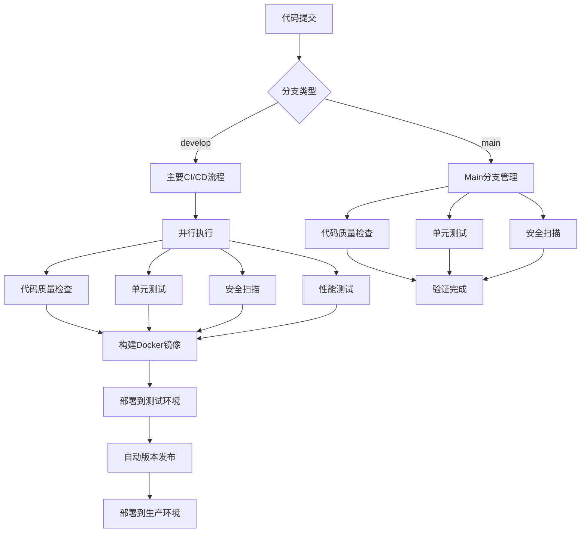
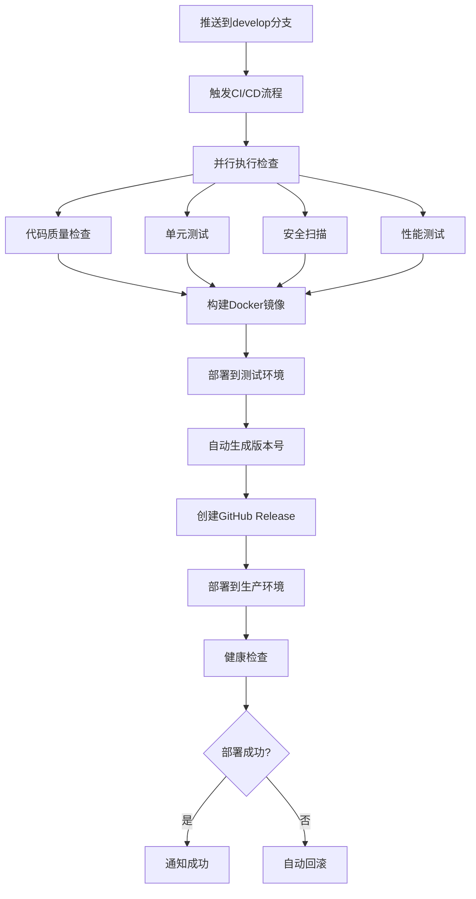
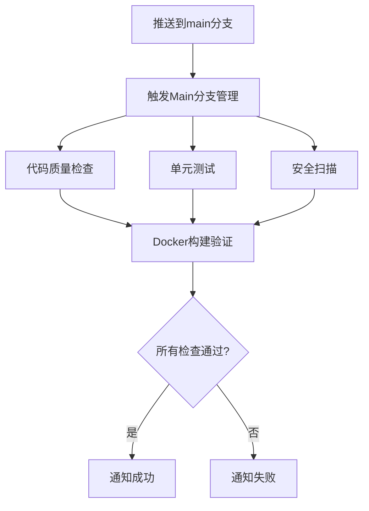
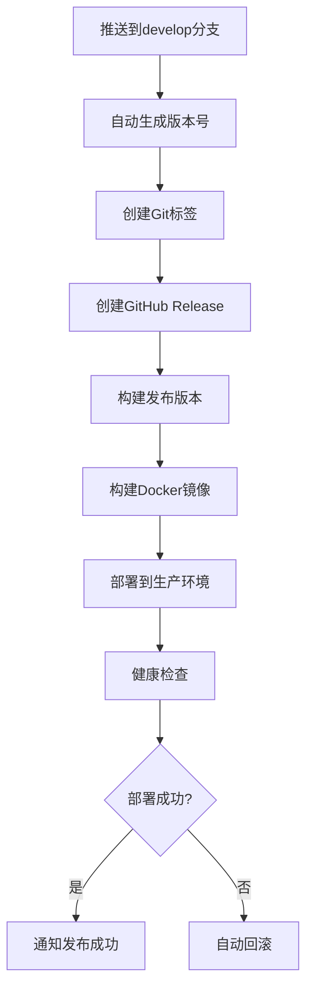

# CI/CD 流程说明

## 概述

本项目使用GitHub Actions实现完整的CI/CD流程，包括代码质量检查、自动化测试、安全扫描、Docker镜像构建、部署和监控。经过优化，提供了更快的构建速度、更好的缓存策略、完整的监控和回滚机制。

## 工作流架构

### 分支策略
- **`develop`分支**：主要开发分支，支持版本发布和自动部署
- **`main`分支**：代码管理分支，仅进行质量检查和验证

### 工作流文件
- **`ci.yml`** - 主要CI/CD流程（develop分支）
- **`main-branch.yml`** - Main分支管理工作流
- **`release.yml`** - 版本发布工作流
- **`dependabot.yml`** - 依赖更新工作流

## 运行流程图

### 完整CI/CD流程


### Develop分支流程


### Main分支流程


### 版本发布流程


## 工作流详情

### 1. 主要CI/CD流程 (`.github/workflows/ci.yml`)

**触发条件：**
- 推送到 `develop` 分支
- 创建Pull Request到 `develop` 分支
- 手动触发（workflow_dispatch）

**包含的作业：**

#### 代码质量检查 (code-quality)
- 使用SpotBugs进行静态代码分析
- 使用Checkstyle检查代码风格
- 使用PMD检查代码质量
- 生成代码质量报告

#### 单元测试 (unit-tests)
- 启动MySQL和Redis测试服务
- 运行所有单元测试
- 生成测试覆盖率报告
- 上传测试结果

#### 集成测试 (integration-tests)
- 运行集成测试套件
- 验证系统组件间的交互

#### 性能测试 (performance-tests)
- 运行负载测试
- 运行压力测试
- 生成性能报告

#### 安全扫描 (security-scan)
- 使用OWASP Dependency Check扫描依赖漏洞
- 生成安全报告

#### Docker镜像构建 (build-docker)
- 构建多架构Docker镜像 (linux/amd64, linux/arm64)
- 推送到GitHub Container Registry
- 使用Docker Buildx和缓存优化

#### 部署 (deploy-staging)
- 自动部署到测试环境
- 健康检查
- 状态通知

### 2. Main分支管理工作流 (`.github/workflows/main-branch.yml`)

**触发条件：**
- 推送到 `main` 分支
- 创建Pull Request到 `main` 分支

**功能：**
- 代码质量检查
- 单元测试
- 安全扫描
- Docker构建验证（不部署）
- 状态通知

### 3. 发布工作流 (`.github/workflows/release.yml`)

**触发条件：**
- 推送到 `develop` 分支（自动生成版本号）
- 推送分支版本 (v*/develop)
- 手动触发发布

**功能：**
- 自动版本生成
- 创建GitHub Release
- 构建发布版本
- Docker镜像构建
- 自动部署到生产环境
- 回滚检查

### 4. 依赖更新 (`.github/workflows/dependabot.yml`)

**功能：**
- 自动合并Dependabot的依赖更新PR
- 安全检查机制
- 仅自动合并安全的更新

## 部署策略

### 测试环境部署
- **触发**：推送到develop分支
- **环境**：staging
- **镜像标签**：develop
- **健康检查**：自动执行

### 生产环境部署
- **触发**：从develop分支发布版本
- **环境**：production
- **镜像标签**：版本号
- **健康检查**：自动执行
- **回滚机制**：部署失败时自动回滚

## 版本管理

### 版本号生成
- **格式**：v1.0.0, v1.0.1, v1.0.2
- **生成方式**：基于最新标签自动递增PATCH版本
- **标签创建**：自动创建Git标签
- **Release创建**：自动创建GitHub Release

### 版本发布流程
1. 推送到develop分支
2. 自动生成版本号
3. 创建Git标签
4. 创建GitHub Release
5. 构建Docker镜像
6. 部署到生产环境

## 监控和告警

### 健康检查
- 应用健康检查：`/actuator/health`
- 数据库连接检查
- Redis连接检查
- 服务可用性检查

### 告警机制
- 构建失败告警
- 部署失败告警
- 健康检查失败告警
- 自动回滚通知

## 使用指南

### 日常开发流程
```bash
# 1. 在develop分支开发
git checkout develop
git add .
git commit -m "feat: add new feature"
git push origin develop

# 2. 自动触发CI/CD
# - 代码质量检查
# - 单元测试
# - 安全扫描
# - 性能测试
# - 部署到测试环境
# - 自动生成版本号并发布
```

### 代码管理流程
```bash
# 1. 合并到main分支
git checkout main
git merge develop
git push origin main

# 2. 自动触发代码管理
# - 代码质量检查
# - 单元测试
# - 安全扫描
# - Docker构建验证
```

### 手动部署
```bash
# 使用Docker Compose
docker-compose -f docker-compose.production.yml up -d

# 使用Kubernetes
kubectl apply -f k8s/production/
```

## 故障排除

### 构建失败
- 检查代码质量报告
- 修复测试失败
- 更新依赖版本

### 部署失败
- 检查环境变量配置
- 验证镜像构建
- 检查资源限制

### 性能问题
- 调整JVM参数
- 优化资源配置
- 监控应用指标

## 最佳实践

### 代码提交
- 小批量提交
- 清晰的提交信息
- 代码审查
- 使用conventional commits格式

### 测试策略
- 单元测试覆盖（目标：80%+）
- 集成测试验证
- 性能测试（负载、压力、峰值）
- 自动化测试报告

### 部署策略
- 蓝绿部署
- 滚动更新
- 自动回滚
- 健康检查

### 监控和告警
- 应用健康监控
- 性能指标监控
- 错误率监控
- 自动告警通知

### 缓存优化
- Maven依赖缓存
- Docker构建缓存
- 应用级缓存
- CDN缓存

### 安全实践
- 依赖漏洞扫描
- 容器安全扫描
- 代码安全扫描
- 定期安全更新

## 联系信息

如有问题，请联系：
- 邮箱：xichen@example.com
- GitHub：@xichen