# 🚀 Wiki Backend System

A modern, scalable wiki backend system built with Spring Boot, featuring comprehensive CI/CD pipeline, automated testing, and multi-environment deployment.

## 📋 Overview

This project implements a complete wiki backend system with the following features:

- ⚡ **Fast Development**: Parallel execution, intelligent caching
- 🔒 **Secure & Reliable**: Multi-layer security checks, automatic rollback
- 📊 **Comprehensive Monitoring**: Real-time status, detailed reports
- 🎯 **Smart Release**: Automatic version management, zero-downtime deployment

## 🏗️ Architecture

### 🌿 Branch Strategy
| Branch | Purpose | Trigger Workflow | Deployment Environment | Version Strategy |
|--------|---------|------------------|----------------------|------------------|
| `develop` | Main development branch | `ci.yml` | Test → Production | Auto-increment PATCH version |
| `main` | Code management branch | `main-branch.yml` | Validation only | No version release |
| `v*/develop` | Major version development | `release.yml` | Production | Increment PATCH based on major version |

### 📁 Workflow Files
| File | Function | Trigger Condition | Main Jobs |
|------|----------|-------------------|-----------|
| `ci.yml` | Main CI/CD pipeline | develop branch push | Quality checks, tests, build, deploy |
| `main-branch.yml` | Main branch management | main branch push | Quality checks, tests, validation |
| `release.yml` | Version release | develop push, manual trigger | Version generation, release, deploy |
| `dependabot.yml` | Dependency updates | Dependabot PR | Security checks, auto-merge |

## 🔄 Process Flow

### 🎯 Complete CI/CD Process

```mermaid
graph TD
    A[📝 Code Commit] --> B{🌿 Branch Type}
    B -->|develop| C[🚀 Main CI/CD Process]
    B -->|main| D[📋 Main Branch Management]
    
    C --> E[⚡ Parallel Execution]
    E --> F[🔍 Code Quality Checks]
    E --> G[🧪 Unit Tests]
    E --> H[🔒 Security Scans]
    E --> I[📊 Performance Tests]
    
    F --> J[🐳 Build Docker Image]
    G --> J
    H --> J
    I --> J
    
    J --> K[🚀 Deploy to Test Environment]
    K --> L[🏷️ Auto Version Release]
    L --> M[🌐 Deploy to Production]
    
    D --> N[🔍 Code Quality Checks]
    D --> O[🧪 Unit Tests]
    D --> P[🔒 Security Scans]
    N --> Q[✅ Validation Complete]
    O --> Q
    P --> Q
```


## 🚀 Quick Start

### Prerequisites
- Java 17+
- Maven 3.6+
- Docker & Docker Compose
- MySQL 8.0+
- Redis 6.0+

### Installation
```bash
# 1. Clone the repository
git clone https://github.com/your-username/wiki-backend.git
cd wiki-backend

# 2. Set up environment
cp application.properties.example application.properties
# Edit application.properties with your database and Redis settings

# 3. Start services
docker-compose up -d

# 4. Run the application
./mvnw spring-boot:run
```

### Development Workflow
```bash
# 1. Daily development
git checkout develop
git add .
git commit -m "feat: add new feature"
git push origin develop

# 2. Auto-triggered CI/CD
# ✅ Code quality checks
# ✅ Unit tests
# ✅ Security scans
# ✅ Performance tests
# ✅ Deploy to test environment
# ✅ Auto-generate version and release
```

### Major Version Development
```bash
# 1. Create major version branch
git checkout -b v1.0.0/develop
git push origin v1.0.0/develop

# 2. Develop on major version branch
git add .
git commit -m "feat: add v1.0.0 feature"
git push origin v1.0.0/develop

# 3. Auto-triggered version release
# ✅ Auto-increment PATCH version based on major version
# ✅ Create Git tags (e.g., v1.0.0, v1.0.1, v1.0.2)
# ✅ Create GitHub Release
# ✅ Build Docker image
# ✅ Deploy to production
```

## 🏷️ Version Management

### 📊 Version Number Generation
| Branch Type | Version Format | Generation Method | Example |
|-------------|----------------|-------------------|---------|
| **develop branch** | v1.0.0, v1.0.1, v1.0.2 | Auto-increment PATCH based on latest tag | v1.0.0 → v1.0.1 |
| **v*/develop branch** | v1.0.0, v1.0.1, v1.0.2 | Auto-increment PATCH based on major version | v1.0.0 → v1.0.1 |
| **Manual trigger** | Custom version | Manually specified version | v2.0.0-beta |

### 🔄 Release Process

#### 🚀 Develop Branch Release
1. 📝 **Push to develop branch**
2. 🏷️ **Auto-generate version number** (increment based on latest tag)
3. 📌 **Create Git tag**
4. 📦 **Create GitHub Release**
5. 🐳 **Build Docker image**
6. 🌐 **Deploy to production**

#### 🏷️ Major Version Branch Release
1. 📝 **Push to v1.0.0/develop branch**
2. 🏷️ **Auto-generate version number** (increment PATCH based on major version)
3. 📌 **Create Git tag**
4. 📦 **Create GitHub Release**
5. 🐳 **Build Docker image**
6. 🌐 **Deploy to production**

## 📦 Package Publishing and Version Management

### 🚀 Package Types

#### **1. JAR Package (Main Release Package)**
- **File**: `wiki-*.jar`
- **Type**: Spring Boot executable JAR
- **Purpose**: Direct deployment to server
- **Run Command**: `java -jar wiki-*.jar`

#### **2. Docker Image (Containerized Deployment)**
- **Image**: `ghcr.io/{repository}/wiki:tag`
- **Architecture**: linux/amd64, linux/arm64
- **Purpose**: Containerized deployment
- **Run Command**: `docker run -p 8080:8080 ghcr.io/{repository}/wiki:tag`

#### **3. Source Package (Optional)**
- **File**: `wiki-source.tar.gz`
- **Content**: Complete source code
- **Purpose**: Source distribution and secondary development

#### **4. Test Report Package**
- **File**: `test-reports.tar.gz`
- **Content**: JaCoCo code coverage reports
- **Purpose**: Quality assessment and auditing

### 🏷️ Version Management Strategy

#### **Version Number Generation Rules**
| Branch Type | Version Format | Generation Method | Example |
|-------------|----------------|-------------------|---------|
| **develop branch** | v1.0.0, v1.0.1, v1.0.2 | Auto-increment PATCH based on latest tag | v1.0.0 → v1.0.1 |
| **v*/develop branch** | v1.0.0, v1.0.1, v1.0.2 | Auto-increment PATCH based on major version | v1.0.0 → v1.0.1 |
| **Manual trigger** | Custom version | Manually specified version | v2.0.0-beta |

#### **Version Release Process**


### 📦 Release Information Format

#### **Release Information Structure**
```markdown
## 🚀 Release v1.0.0

### 📊 Release Information
- **Version**: `v1.0.0`
- **Source Branch**: `v1.0.0/develop`
- **Build Date**: `2024-01-15T10:30:45Z`
- **Total Commits**: `156`
- **Contributors**: `3`

### 📝 What's Changed
- feat: add new user authentication system
- fix: resolve database connection timeout issue
- perf: optimize API response time by 40%

### 🔗 Links
- **Full Changelog**: https://github.com/.../compare/v0.9.0...v1.0.0
- **Docker Image**: `ghcr.io/.../wiki-back:v1.0.0`
- **GitHub Actions**: https://github.com/.../actions

### 🏷️ Version History
This release includes all changes with the following improvements:
- ✅ Automated CI/CD pipeline execution
- ✅ Multi-architecture Docker image build
- ✅ Comprehensive testing and quality checks
```

### 🔧 Package Usage

#### **Running JAR Package**
```bash
# Download JAR package
wget https://github.com/{owner}/{repo}/releases/download/v1.0.0/wiki-1.0.0.jar

# Run application
java -jar wiki-1.0.0.jar

# Specify configuration file
java -jar wiki-1.0.0.jar --spring.profiles.active=prod
```

#### **Running Docker Image**
```bash
# Pull image
docker pull ghcr.io/{owner}/{repo}/wiki:v1.0.0

# Run container
docker run -d \
  --name wiki-app \
  -p 8080:8080 \
  -e SPRING_PROFILES_ACTIVE=prod \
  ghcr.io/{owner}/{repo}/wiki:v1.0.0

# Use Docker Compose
docker-compose up -d
```

#### **Deploy to Kubernetes**
```yaml
apiVersion: apps/v1
kind: Deployment
metadata:
  name: wiki-app
spec:
  replicas: 3
  selector:
    matchLabels:
      app: wiki-app
  template:
    metadata:
      labels:
        app: wiki-app
    spec:
      containers:
      - name: wiki-app
        image: ghcr.io/{owner}/{repo}/wiki:v1.0.0
        ports:
        - containerPort: 8080
        env:
        - name: SPRING_PROFILES_ACTIVE
          value: "prod"
```

## 🔧 Workflow Details

### 1. 🚀 Main CI/CD Pipeline (`.github/workflows/ci.yml`)

**Trigger Conditions:**
- 📝 Push to `develop` branch
- 🔄 Create Pull Request to `develop` branch
- 🎯 Manual trigger (workflow_dispatch)

**Included Jobs:**

#### 🔍 Code Quality Checks (code-quality)
- **SpotBugs**: Static code analysis, detect potential bugs
- **Checkstyle**: Code style checks, ensure code standards
- **PMD**: Code quality analysis, optimize code structure
- **Report Generation**: Detailed code quality reports

#### 🧪 Unit Tests (unit-tests)
- **Service Startup**: MySQL and Redis test services
- **Test Execution**: Run all unit tests
- **Coverage Reports**: Generate test coverage reports
- **Result Upload**: Upload test results and reports

#### 🔗 Integration Tests (integration-tests)
- **Test Suite**: Run complete integration tests
- **Component Validation**: Verify system component interactions
- **Environment Testing**: Test in real environment

#### 📊 Performance Tests (performance-tests)
- **Load Testing**: Simulate real user load
- **Stress Testing**: Test system performance limits
- **Performance Reports**: Detailed performance analysis reports

#### 🔒 Security Scans (security-scan)
- **Dependency Scanning**: OWASP Dependency Check vulnerability scanning
- **Security Reports**: Detailed security analysis reports
- **Vulnerability Fixes**: Provide fix recommendations

#### 🐳 Docker Image Build (build-docker)
- **Multi-architecture Support**: linux/amd64, linux/arm64
- **Container Registry**: Push to GitHub Container Registry
- **Build Optimization**: Docker Buildx and cache optimization

#### 🚀 Deployment (deploy-staging)
- **Auto Deployment**: Deploy to test environment
- **Health Checks**: Automatic health checks
- **Status Notifications**: Real-time status notifications

### 2. 📋 Main Branch Management (`.github/workflows/main-branch.yml`)

**Trigger Conditions:**
- 📝 Push to `main` branch
- 🔄 Create Pull Request to `main` branch

**Features:**
- 🔍 **Code Quality Checks**: SpotBugs, Checkstyle, PMD
- 🧪 **Unit Tests**: Complete test suite execution
- 🔒 **Security Scans**: OWASP dependency vulnerability scanning
- 🐳 **Docker Build Validation**: Verify image build (no deployment)
- 📢 **Status Notifications**: Real-time status notifications

### 3. 🏷️ Release Workflow (`.github/workflows/release.yml`)

**Trigger Conditions:**
- 📝 Push to `develop` branch (auto-generate version)
- 🌿 Push branch version (v*/develop)
- 🎯 Manual trigger release

**Features:**
- 🏷️ **Auto Version Generation**: Increment version based on latest tag
- 📦 **Create GitHub Release**: Auto-create release page
- 🔨 **Build Release Version**: Production environment build
- 🐳 **Docker Image Build**: Multi-architecture image build
- 🌐 **Auto Deploy to Production**: Zero-downtime deployment
- 🔄 **Rollback Check**: Auto-rollback on deployment failure

### 4. 🔄 Dependency Updates (`.github/workflows/dependabot.yml`)

**Features:**
- 🤖 **Auto Merge**: Dependabot dependency update PRs
- 🔒 **Security Check Mechanism**: Only merge secure updates
- ⚡ **Smart Filtering**: Avoid conflicting dependency updates
- 📢 **Notification Mechanism**: Update status notifications

## 🚀 Deployment Strategy

### 🧪 Test Environment Deployment
| Item | Details |
|------|---------|
| **Trigger** | Push to develop branch |
| **Environment** | staging |
| **Image Tag** | develop |
| **Health Check** | Auto-execute |
| **Deployment Method** | Blue-green deployment |

### 🌐 Production Environment Deployment
| Item | Details |
|------|---------|
| **Trigger** | Release from develop branch |
| **Environment** | production |
| **Image Tag** | Version number |
| **Health Check** | Auto-execute |
| **Rollback Mechanism** | Auto-rollback on deployment failure |
| **Deployment Method** | Rolling update |

## 📊 Monitoring and Alerts

### 💚 Health Checks
| Check Item | Endpoint | Check Content |
|------------|----------|---------------|
| **Application Health** | `/actuator/health` | Application status, memory, CPU |
| **Database Connection** | Auto-check | Connection status, response time |
| **Redis Connection** | Auto-check | Connection status, cache performance |
| **Service Availability** | Auto-check | Service response, load balancing |

### 🚨 Alert Mechanism
| Alert Type | Trigger Condition | Notification Method |
|------------|-------------------|-------------------|
| **Build Failure** | CI/CD process failure | Email, Slack |
| **Deployment Failure** | Deployment process failure | Email, Slack |
| **Health Check Failure** | Service unavailable | Email, Slack |
| **Auto Rollback** | Deployment failure rollback | Email, Slack |

## 🎯 Best Practices

### 📝 Code Commits
| Practice | Description |
|----------|-------------|
| **Small Batches** | Each commit contains only one feature |
| **Clear Messages** | Use conventional commits format |
| **Code Review** | All code must be reviewed |
| **Test Coverage** | New features must include tests |

### 🧪 Testing Strategy
| Test Type | Coverage Target | Description |
|-----------|----------------|-------------|
| **Unit Tests** | 80%+ | Core business logic testing |
| **Integration Tests** | 60%+ | Component interaction testing |
| **Performance Tests** | 100% | Load, stress, peak testing |
| **Automated Reports** | 100% | Auto-generate test results |

### 🚀 Deployment Strategy
| Strategy | Description |
|----------|-------------|
| **Blue-green Deployment** | Zero-downtime deployment, fast rollback |
| **Rolling Updates** | Progressive updates, reduce risk |
| **Auto Rollback** | Auto-rollback on deployment failure |
| **Health Checks** | Auto health checks after deployment |

### 📊 Monitoring and Alerts
| Monitoring Item | Alert Threshold | Description |
|-----------------|----------------|-------------|
| **Application Health** | Response time > 2s | Application performance monitoring |
| **Error Rate** | Error rate > 1% | Error rate monitoring |
| **Resource Usage** | CPU > 80% | Resource usage monitoring |
| **Auto Alerts** | Real-time notification | Multi-channel alert notifications |

### ⚡ Cache Optimization
| Cache Type | Optimization Strategy | Description |
|------------|----------------------|-------------|
| **Maven Dependencies** | Smart caching | Accelerate build process |
| **Docker Build** | Layer caching | Reduce build time |
| **Application Cache** | Redis caching | Improve response speed |
| **CDN Cache** | Static resources | Accelerate resource loading |

### 🔒 Security Practices
| Security Measure | Check Frequency | Description |
|------------------|----------------|-------------|
| **Dependency Vulnerability Scan** | Every build | OWASP Dependency Check |
| **Container Security Scan** | Every build | Image security scanning |
| **Code Security Scan** | Every commit | Static code analysis |
| **Regular Security Updates** | Weekly | Dependency updates and patches |

## 🔧 Troubleshooting

### ❌ Common Issues

#### Build Failures
| Problem Type | Solution |
|--------------|----------|
| **Code Quality** | Check SpotBugs, Checkstyle, PMD reports |
| **Test Failures** | Fix unit tests, check test coverage |
| **Dependency Issues** | Update dependency versions, check compatibility |

#### Deployment Failures
| Problem Type | Solution |
|--------------|----------|
| **Environment Variables** | Check configuration, verify environment variables |
| **Image Build** | Verify Docker image, check build logs |
| **Resource Limits** | Adjust memory, CPU limits |

#### Performance Issues
| Problem Type | Solution |
|--------------|----------|
| **JVM Parameters** | Adjust heap memory, GC parameters |
| **Resource Configuration** | Optimize CPU, memory allocation |
| **Application Monitoring** | Monitor performance metrics, analyze bottlenecks |

## 📚 Documentation Structure

- 📖 [CI/CD Documentation](./CI-CD.md) - Complete CI/CD process documentation (including package publishing and version management)
- 🏗️ [Architecture Documentation](./docs/ARCHITECTURE.md) - System architecture and tech stack
- 📖 [API Documentation](./docs/API.md) - Complete API interface documentation
- 🌍 [English Documentation](./README_EN.md) - Complete English project documentation

## 📞 Contact Information

For questions, please contact:
- 📧 **Email**: xichen@example.com
- 🐙 **GitHub**: @xichen
- 📱 **Slack**: #wiki-dev
- 🔗 **GitHub Actions**: [View Workflow Status](https://github.com/xichen/wiki/actions)
- 🐳 **Docker Images**: [View Image List](https://github.com/xichen/wiki/pkgs/container/wiki)

## 📄 License

This project is licensed under the MIT License - see the [LICENSE](LICENSE) file for details.

## 📚 Documentation Structure

- 📖 [CI/CD Documentation](./CI-CD.md) - Complete CI/CD process documentation (including package publishing and version management)
- 🏗️ [Architecture Documentation](./docs/ARCHITECTURE.md) - System architecture and tech stack
- 📖 [API Documentation](./docs/API.md) - Complete API interface documentation
- 🌍 [English Documentation](./README_EN.md) - Complete English project documentation

## 🤝 Contributing

1. Fork the repository
2. Create your feature branch (`git checkout -b feature/AmazingFeature`)
3. Commit your changes (`git commit -m 'Add some AmazingFeature'`)
4. Push to the branch (`git push origin feature/AmazingFeature`)
5. Open a Pull Request

## 🙏 Acknowledgments

- Spring Boot team for the excellent framework
- GitHub Actions for CI/CD automation
- Docker for containerization
- All contributors who helped improve this project
